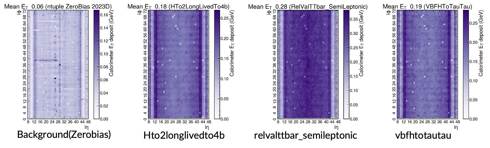
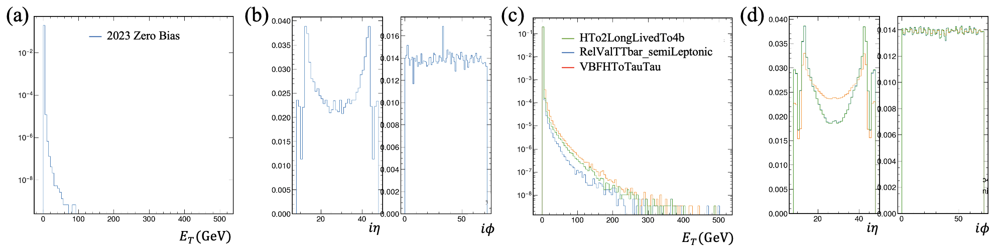

# CICADA Project
---


---
A “Periodical cicada” (magicicada septendecim) only emerge every 17 years and are noted for their [song](https://upload.wikimedia.org/wikipedia/commons/7/7a/A_Magicicada_chorus_containing_M._septendecim%2C_M._cassini%2C_and_M._septendecula_-_pone.0000892.s004.oga).

**Calorimeter Image Convolutional Anomaly Detection Algorithm** (CICADA) uses low level Compact Muon Solenoid experiment's trigger calorimeter information as the input to convolutional autoencoder to find anomalies produced during Large Hadron Collider proton-proton collisionsis. Quantization Aware Training and Knowledge Distillation are used to compress the model for sub-500ns inference on Field-Programmable Gate Arrays.

## Table of contents
  - [Papers](#Papers)
  - [Contact Us](#Contact-Us)
  - [Funding](#Funding)
- [Setup Environment](#Setup-Environment)
  - [Access to Datasets](#Access-to-Datasets)
  - [Converting ROOT to H5](#Converting-ROOT-to-H5)
  - [Profiling](#Profiling)
- [Configuration](#Configuration)
- [Training](#Training)
- [Compilation](#Compilation)
- [CTP7cpp](#CTP7cpp)
---
### Papers

- [X] First paper coming soon...

### Contact Us

You could email us at [cicada-project@cern.ch](mailto:cicada-project@cern.ch). Visit our [website](https://cicada.web.cern.ch/) to find our latest talks:


### Funding
This work is funded by the Eric and Wendy Schmidt foundation.

---
## Setup Environment

We suggest using `conda` to setup the environment with the commands below. Note: If you are working on lxplus (or a machine with limited home directory space) you should change the directory where the environment and added packages are stored, this can be done in the ```.condarc``` file by adding the following text.
```
pkgs_dirs:
  - /afs/cern.ch/work/$USER/condapackages  (for CERN clusters)
  - /nfs_scratch/$USER/condapackages  (for Wisconsin clusters)
envs_dirs:
  - /afs/cern.ch/work/$USER/condaenvs  (for CERN clusters)
  - /nfs_scratch/$USER/condaenvs  (for Wisconsin clusters)
```
Setup your conda environment as below. 
```
conda create -n "cicada" python=3.9.16 numpy==1.26.0
conda activate cicada
python3 -m pip install -r misc/requirements.txt
```
---
## Datasets

### Access to Datasets
The data needed for running the scripts is available on `eos` under `/eos/project-c/cicada-project/`. The directory contains both `root` and `h5` files. To access these files, please contact admins at [cicada-project@cern.ch](mailto:cicada-project@cern.ch) with the title *Data access request for [Your Name]*.

### Converting ROOT to H5
The `convert-root-to-h5-granular.py` file helps convert root files into h5 files with desriable input format (72 $\phi$ * 40 $\eta$) in HLT.
```
python3 convert-root-to-h5-granular.py --calotree "HLTCaloTowers/Events" <source_root_directory> <save_path_prefix> 
```
This script can be run using additional options. `--acceptance` will store acceptance information, i.e. if an event has at least one jet of minimum pT of 30 GeV in the central region. `-–split` will produce three additional files to help with train-validation-test split (split is a bool input). **Mind that the `h5` files are prepared and stored already in `eos`.**

### Profiling
You may wish to profile the dataset to spot potential problems, e.g. $E_T$, $\eta$ or $\phi$ distribution is corrupted. It also prints number of available samples, acceptance ratios. To run, execute the following:
```
python3 dataset-profiling.py
```
Fro sanity check, the profiling results for datasets in `misc/config-wisc.yml` are shown as follows: 




---
## Configuration
In `misc/config-wisc.yml` you will find a configuration file used by most of the scripts throughout this repository. It contains data sources for background, signal and exposure datasets. The usage of these is controlled by `use` flag. Insted of editing the file, you could copy it and use a custom one using `--config` scripts.

---
## Models
In `models_v1.py`, we store the latest model configuration for cicada HLT. You can further optimize the architecture to improve the model's performance.

---
## Training
We follow the training procedure as outlined in this [paper](https://arxiv.org/abs/2310.06047). To run, execute the following:
```
python3 cicada-training.py
```
This script can be run using additional `--epochs` argument controlling the length of the training. 
In particular, if you want to solely train the teacher model and evaluate its performance, you can execute the `cicada-teacher-training.py` in a similar manner. 

---
## Evaluation
The `cicada-training.py` script will automatically produce the reconstruction comparison, the anomaly score distribution and the ROC curves for model evaluation after the training process is completed. While if you want to further evaluate trained models stored in the `/models` directory, you can run the following:
```
python3 reconstruction.py --config <config path>
```
which creates the reconstruction plots of events with the two smallest and largest anomaly scores for all the datasets; and
```
python3 anomaly_score.py --config <config path>
```
which generates the anomaly score distribution for given models.


---
## Compilation
We compile `QKeras` model to `C++` using `hls4ml`. The script run a few additional checks to check there agreement between `hls4ml` and `tensorflow` model respective outputs. To run, execute the following:
```
python3 compile-to-cpp.py --version <version>
```
Version argument should be either `1.1.2` or `2.1.2`. **The models used for compilation are loaded from HuggingFace, not the local directory**.

---
## CTP7cpp
The files generated by `hls4ml` can be integrated within [CTP7cpp](https://github.com/Princeton-AD/ctp7cpp) code to generate the IP containing both CICADA and [WOMBAT](https://github.com/Princeton-AD/wombat).

---
